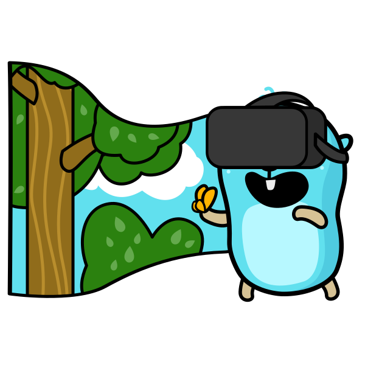
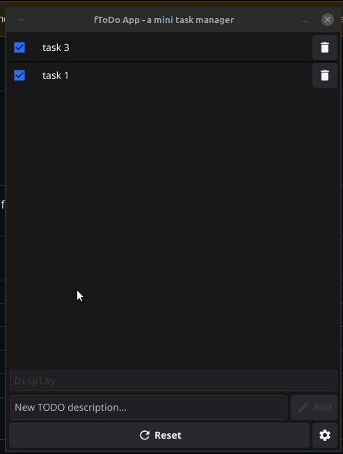

<div align="center">

# fToDo App

<p style="margin-bottom: 16px;">
    Golang desktop todo app using Fyne UI framework.
</p>



<br />

 

</div>

<hr />

### Features 🚀

<div align="center" style="margin-bottom: 16px;">



</div>

- [x] **Using the [Fyne](https://fyne.io/) UI framework:** `Fyne` is a framework that allows us to build native cross-platform graphical interfaces. Its documentation is very beginner-friendly, the resulting binaries are small and allow you to package all the resources, and compile quickly (cross-compilation is possible). Although it is very popular and much easier to use than libraries like GTK-4 (Go binding), and you don't have to code too much to do basic things, it can fall short when we want to build more complex interfaces. However, `Fyne` looks beautiful on all platforms and is evolving rapidly, so this situation may change 🙏…
- [x] **Using `SQLite3` as a database:** `SQLite` is an embedded SQL database engine. Unlike most other SQL databases, `SQLite` does not have a separate server process. `SQLite` reads and writes directly to ordinary disk files. A complete SQL database with multiple tables, indices, triggers, and views, is contained in a single disk file. The database file format is cross-platform - you can freely copy a database between 32-bit and 64-bit systems or between big-endian and little-endian architectures.
- [x] **Possibility to export/import data to/from `.csv` format:** The application generates a file (`ftodos.csv`) in the user folder when we export the data. Comma-separated values (`CSV`) is a text file format that uses commas to separate values, and newlines to separate records. A `CSV` file stores tabular data (numbers and text) in plain text, where each line of the file typically represents one data record. To import such data, the file (generated by the application or by us in the appropriate format for reading) must also be located in the user folder. Two libraries are used to perform the export/import:
    - **[sqltocsv](https://github.com/joho/sqltocsv)** a library designed to let you easily turn any arbitrary sql.Rows result from a query into a CSV file with a minimum of fuss.
    - **[csv](https://github.com/earthboundkid/csv)** a Golang CSV reader like Python's DictReader, which converts the read .csv file into a `[]map[string]string` which is later used to create the query that will populate a new table in the database.
- [x] **Multi-view layout:** Although `Fyne` allows a classic desktop application layout (with menu bar, tabs, etc.), we have adopted a "multi-view layout" similar to the web or mobile applications, which the developer can easily modify to add additional views. All of this is a demonstration of the versatility of `Fyne`.


<br />


>[!NOTE]
>***Until `v1.0.10` the database had been [cloverDB](https://github.com/ostafen/clover). It is a lightweight, document-oriented NoSQL database that, as it does not use SQL, is extraordinarily easy to use and as its creators say: "`CloverDB` has been written to be easily maintainable. As such, it sacrifices performance for simplicity, and is not intended to be an alternative to higher performance databases such as `MongoDB` or `MySQL`. However, there are projects where running a separate database server may be overkill, and for simple queries, network latency can be the main performance bottleneck. For such scenarios, `CloverDB` may be a more suitable alternative." If you prefer to use `CloverDB` instead of `SQLite3`, you can view the code for that version ([v1.0.10](https://github.com/emarifer/go-fyne-desktop-todoapp/tree/v1.0.10)), or clone the repository and reset your workspace to the corresponding Git commit ([6af9aab](https://github.com/emarifer/go-fyne-desktop-todoapp/tree/6af9aabb9e3fb4327d34768387a83b5aaf3bfd8e)).***

---

### 👨‍🚀 Getting Started:

#### Installing the application

If you don't have Go, you can download the appropriate executable for your platform from [here](https://github.com/emarifer/go-fyne-desktop-todoapp/releases). Once unpacked, you can place it in the folder where your system normally stores executables (although you could place it in any directory). Then, you just need to update the system PATH with that address. For Linux, if you run the Makefile ("make user-install" to install to ~/.local/, or "make user-uninstall" to uninstall) you can easily install the application for the user or on the system.

If you have Go installed (Go 1.23 or higher is required), you will also need to install the dependencies required by `Fyne` (see [here](https://docs.fyne.io/started/) for the prerequisites for your platform). Now, clone the repository and in the project folder run the following commands to run the application in development mode:

```
$ go mod tidy && make run
```

#### Packaging for Desktop

If you have modified the code and want to package the application into a single binary (with all assets and in production mode), the **Fyne CLI** tool can be very useful (you can install it on your system with the command `go install fyne.io/fyne/v2/cmd/fyne@latest`). Once this is done, run the following commands in the project folder:

```
$ make generate-textfiles
$ make package-linux # or `make package-windows` / `make package-darwin`, depending on your platform
```

If you have difficulties in any step or due to peculiarities of your system/platform, consult the `Fyne` documentation.

---

### Happy coding 😀!!